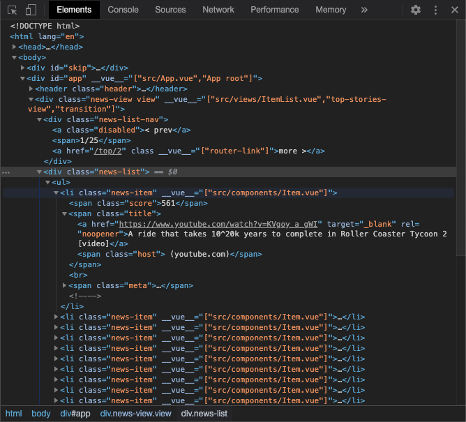

# 💡 vue-dom-hints <a href="https://npm.im/vue-dom-hints"></a> <a href="https://npm.im/vue-dom-hints"></a> <a href="https://packagephobia.now.sh/result?p=vue-dom-hints"></a>

<p align="center">
  
  <br>
  <br>
  <strong>A light-weight Vue devtool that adds hints in the DOM</strong>
  <br>
  <i>Instantly identify Vue components in DOM and which file they're located in</i>
</p>

## ℹ️ About
`vue-dom-hints` is a Vue.js 2 plugin that makes it easier to inspect components using simple browser dev tools (DOM inspection & console).

It adds the following to DOM elements associated with a component:
- `__vue__` attribute containing an array of component paths/names
- `__vms__` property containing an array of View Model instances

### Motivation
Vue.js is often debugged with [the Vue Devtools browser extension](https://devtools.vuejs.org/), however, it may not always suit your needs. For us, it was not compatible with a multi-app setup with iframes.

Additionally, the browser extension leverages the `__vue__` property to detect components on the page, and [it wasn't sufficient for detecting _all_ components](#why-is-the-__vue__-property-not-enough).

Finally, for devs that are comfortable with interfacing with components directly, being able to access all this data in the browser console offered much more flexibility and insight.

## 🚀 Install
```sh
npm i vue-dom-hints
```

## 🚦 Setup
Install it to your Vue app as a [plugin](https://vuejs.org/v2/guide/plugins.html#Using-a-Plugin):
```js
import Vue from 'vue'
import DomHints from 'vue-dom-hints'

// Only enable it during development
if (process.env.NODE_ENV !== 'production') {
    Vue.use(DomHints)
}
```

#### Pass in options
```js
Vue.use(DomHints, {
    attributeName: 'vue',
    vmsPropertyName: 'vms',
    showDevtip: false
})
```


## 🌟 Usage

### Find Vue components in the DOM

Since this plugin adds a `__vue__` attribute to all DOM elements associated with a Vue component, components can be identified easily when skimming through the DOM.

#### Select all Vue components in the DOM
In the Dev console, you can even pass in a selector to find them:
```js
// In Chrome:
$$('[__vue__]')

// Alternatively:
document.querySelectorAll('[__vue__]')
```

#### Search by Vue component file path
You can even search for the component by file path. For example, when looking for a component with file name `FormInput.vue`, you can use the following selector:
```js
// In Chrome:
$$('[__vue__*="FormInput.vue"]')

// Alternatively:
document.querySelectorAll('[__vue__*="FormInput.vue"]')
```

### Inspect the DOM element's View Model

The View Model (VM) is the component _instance_—it's the `this` reference you have access to in the component's methods.

By default, Vue.js attaches the VM to the DOM element in a property called `__vue__`.

You can inspect the VM by selecting an element in the DOM and entering in the console:

```js
$0.__vue__
```

#### Get all components associated with an element
When a component uses another component as the root-element, the rendered DOM element is associated with two VMs. However, `__vue__` only references the bottom-most VM.

This is why this plugin adds a `__vms__` property to the DOM element, which contains an array of all VMs associated with the element:
```js
$0.__vms__
// => [VueComponent{} VueComponent{}, ...]
```

The array is in order of nesting, so the top-most component is the last item in the array.

## ⚡️ Scripts

Here are some useful scripts you can paste into the dev console after loading the plugin.

### Find the component path within the app
After selecting an component element in the DOM inspector, you can run the following script to get an array of parent-components that led to the component:

```js
(function vmPath(vm) {
    const getName = _vm => _vm.$options.__file || _vm.$options.name || _vm.$options._componentTag || (!_vm.$parent ? '<App root>' : '<anonymous>')
    return [
        {
            name: getName(vm),
            props: vm.$props,
            attrs: vm.$attrs,
            element: vm.$el,
            usedIn: vm.$vnode ? getName(vm.$vnode.context) : null
        },
        ...(vm.$parent ? vmPath(vm.$parent) : [])
    ]
})($0.__vue__) // You can change the starting reference here
```

Previously, you may have had to grep your codebase to determine which file imports a component. With this, you can precisely identify the exact component path that rendered the element and what data it was passed in.


### Find the components that rendered the specific element

As mentioned before, a DOM element can be assocaited with multiple VMs, and this plugin references them in the `__vms__` property as an array ordered by nesting.

To determine the components that rendered the selected DOM element, you can run the following script:

```js
(vms => vms.map(vm => ({
    name: vm.$options.__file || vm.$options.name || vm.$options._componentTag,
    props: vm.$props,
    attrs: vm.$attrs
})))($0.__vms__)
```

The last VM in the array is the top-most component that rendered the element.

### Find all VMs that match a component name

```js
((query) => {
    const elements = document.querySelectorAll(`[__vue__*="${query}"]`)

    return Array.from(elements).flatMap(
        element => element.__vms__.filter(
            (vm) => {
                const name = vm.$options.__file || vm.$options.name || vm.$options._componentTag
                return name.match(query)
            }
        )
    )
})('ComponentName.vue')
```


## ⚙️ Options
#### attributeName

Type: `string`

Default: `__vue__`

The attribute name to use to attach an array of component names to.

#### vmsPropertyName

Type: `string`

Default: `__vms__`

The property name to attach an array of View Model instances to.

#### showDevtip

Type: boolean

Default: `true`

Whether to show the dev tip in the console when loaded

## FAQ

### Why do the attribute & property contain an array?
When a component uses another component as the root-element, the rendered DOM element is associated with two VMs.

In this example, the `my-button` renders a `button` element. So the element is actually asociated with `my-button` and the component using `my-button`:
```html
<template>
  <my-button>
    Click me!
  </my-button>
</template>
```

There's no limit to how much nesting can occur, so the arrays can contain multiple component references.


### Why is the `__vue__` property not enough?
Vue.js adds the `__vue__` property to the DOM element associated with a component. However, elements can be associated with multiple components, and the `__vue__` property only references the bottom-most VM (last to be rendered).

This is why this plugin adds a `__vms__` property to the DOM element, which contains an array of all VMs associated with the element.
